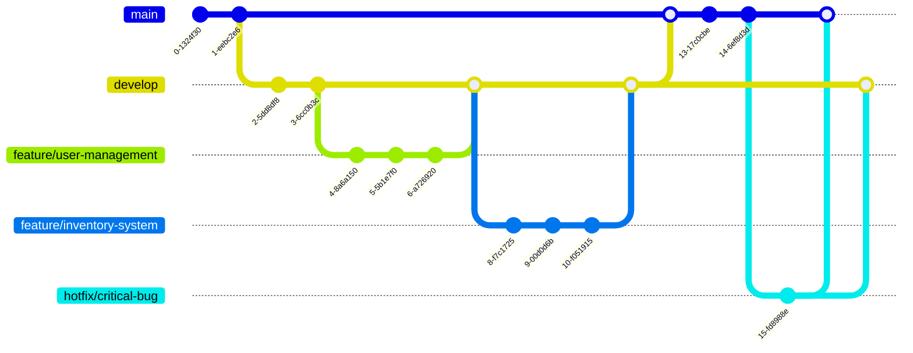
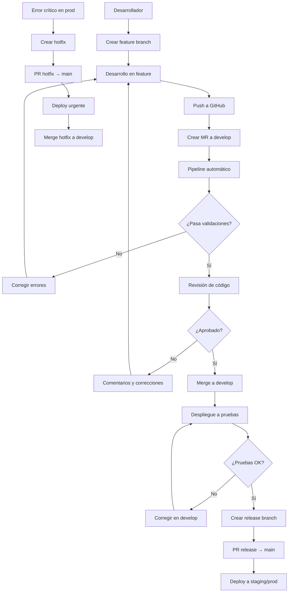

# 🚀 Estrategia de Versionamiento - Git Flow

## 📋 Descripción General

Este proyecto utiliza una estrategia de versionamiento basada en **Git Flow** con dos ramas principales: `main` y `develop`. El flujo de trabajo está diseñado para mantener un desarrollo organizado y controlado, con validaciones automáticas y despliegues progresivos.

## 🏗️ Estructura de Ramas

### Ramas Principales
- **`main`**: Rama de producción - código estable y desplegado
- **`develop`**: Rama de desarrollo - integración de features

### Ramas de Trabajo
- **`feature/nombre`**: Desarrollo de nuevas funcionalidades
- **`hotfix/nombre`**: Correcciones urgentes para producción

## 🔄 Flujo de Desarrollo

### Diagrama del Git Flow



## 📝 Proceso Detallado

### 1. 🚀 Inicio de Desarrollo

```bash
# Crear nueva rama desde develop
git checkout develop
git pull origin develop
git checkout -b feature/nombre-funcionalidad
```

### 2. 💻 Desarrollo en Feature Branch

```bash
# Realizar cambios
git add .
git commit -m "feat: agregar nueva funcionalidad"
git push origin feature/nombre-funcionalidad
```

### 3. 🔄 Crear Merge Request (MR)

1. **Ir a GitHub/GitLab**
2. **Crear Pull Request/Merge Request** desde `feature/nombre` → `develop`
3. **Describir cambios** en el MR
4. **Asignar revisores**

### 4. 🔍 Pipeline Automático

Al crear el MR se dispara automáticamente:

```yaml
# Pipeline de validación
- Compilación del proyecto
- Ejecución de tests unitarios
- Análisis de código con SonarCloud
- Validación de cobertura de código
- Análisis de seguridad
```

### 5. 👥 Revisión de Código

- **Revisor técnico** revisa el código
- **Validación de estándares** de codificación
- **Aprobación** del MR
- **Merge** a `develop`

### 6. 🧪 Pruebas en Servidor de Desarrollo

```bash
# Despliegue automático a ambiente de pruebas
- Validación funcional
- Pruebas de integración
- Pruebas de rendimiento
```

### 7. 🚀 Release a Producción

```bash
# Crear rama de release desde develop
git checkout develop
git checkout -b release/v1.2.0
git push origin release/v1.2.0

# Crear PR desde release → main
# Aprobación y merge a main
```

### 8. 🔥 Hotfix para Producción

```bash
# Crear hotfix desde main
git checkout main
git checkout -b hotfix/critical-fix
git push origin hotfix/critical-fix

# Crear PR desde hotfix → main
# Merge a main y luego a develop
```

## 📊 Diagrama de Flujo Completo



## 🛠️ Comandos Útiles

### Crear Feature Branch
```bash
git checkout develop
git pull origin develop
git checkout -b feature/nombre-funcionalidad
```

### Crear Hotfix
```bash
git checkout main
git pull origin main
git checkout -b hotfix/critical-fix
```

### Sincronizar Develop con Main
```bash
git checkout develop
git pull origin develop
git merge main
git push origin develop
```

### Limpiar Ramas
```bash
# Eliminar ramas feature ya mergeadas
git branch -d feature/nombre-funcionalidad
git push origin --delete feature/nombre-funcionalidad
```

## 📋 Checklist de MR

### Antes de Crear MR
- [ ] Código compila sin errores
- [ ] Tests unitarios pasan
- [ ] Cobertura de código > 80%
- [ ] Código sigue estándares del proyecto
- [ ] Documentación actualizada
- [ ] Commit messages descriptivos

### Durante la Revisión
- [ ] Revisión de código aprobada
- [ ] Pipeline pasa exitosamente
- [ ] SonarCloud sin issues críticos
- [ ] Tests de integración pasan

## 🔧 Configuración de Pipeline

### SonarCloud Integration
```yaml
# .github/workflows/sonarcloud.yml
name: SonarCloud Analysis
on:
  pull_request:
    branches: [develop, main]

jobs:
  sonarcloud:
    runs-on: ubuntu-latest
    steps:
      - uses: actions/checkout@v3
      - name: SonarCloud Scan
        uses: SonarSource/sonarcloud-github-action@master
        env:
          GITHUB_TOKEN: ${{ secrets.GITHUB_TOKEN }}
          SONAR_TOKEN: ${{ secrets.SONAR_TOKEN }}
```

### Coverage Requirements
```yaml
# Configuración mínima de cobertura
- Cobertura total: > 80%
- Cobertura de líneas: > 85%
- Cobertura de branches: > 70%
```

## 🚨 Casos Especiales

### Hotfix Urgente
1. **Crear hotfix** desde `main`
2. **Desarrollo rápido** con cambios mínimos
3. **PR directo** a `main`
4. **Deploy inmediato** a producción
5. **Merge** hotfix a `develop`

### Rollback
```bash
# Si es necesario hacer rollback
git checkout main
git revert <commit-hash>
git push origin main
```

## 📈 Métricas de Calidad

### SonarCloud
- **Duplicación**: < 3%
- **Vulnerabilidades**: 0 críticas
- **Code Smells**: < 10 por 1000 líneas
- **Technical Debt**: < 5%

### Cobertura de Tests
- **Unit Tests**: > 80%
- **Integration Tests**: > 70%
- **E2E Tests**: > 60%

## 🎯 Beneficios de esta Estrategia

1. **Desarrollo Organizado**: Separación clara entre desarrollo y producción
2. **Calidad Controlada**: Validaciones automáticas en cada MR
3. **Despliegue Seguro**: Proceso gradual de pruebas
4. **Rollback Fácil**: Capacidad de revertir cambios rápidamente
5. **Trazabilidad**: Historial completo de cambios y decisiones
