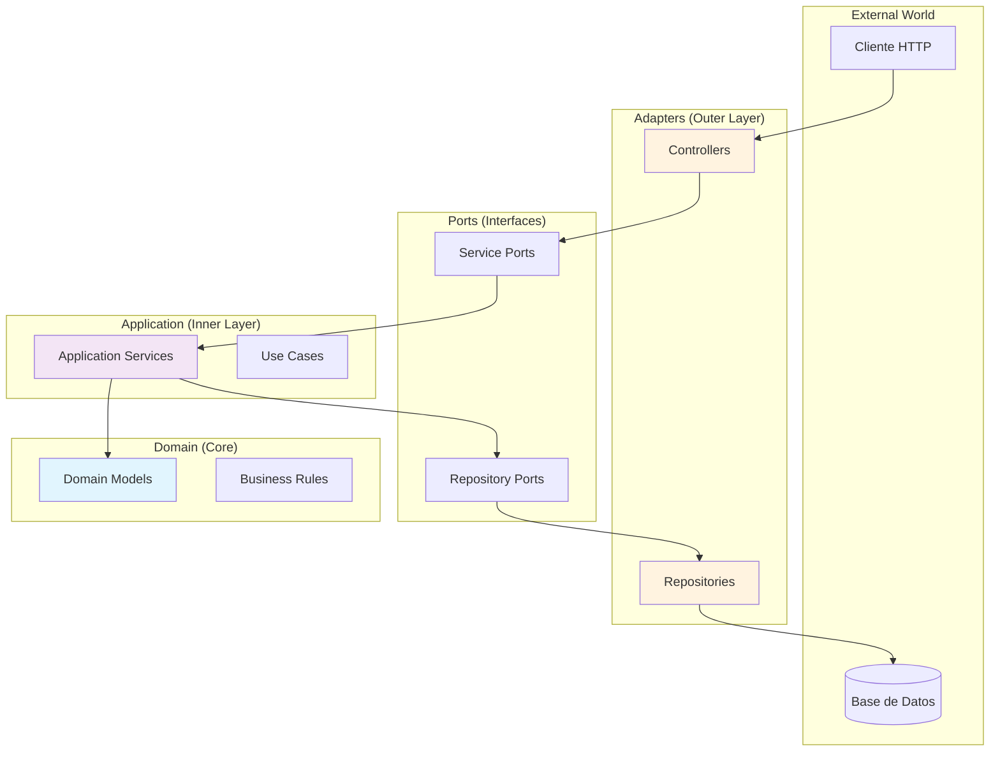
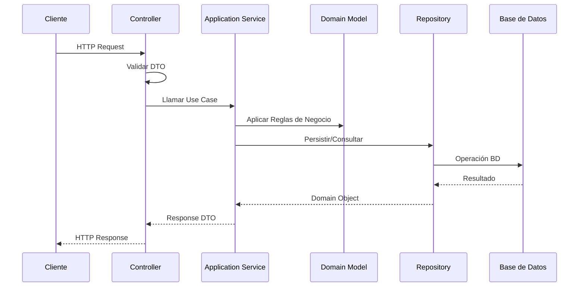
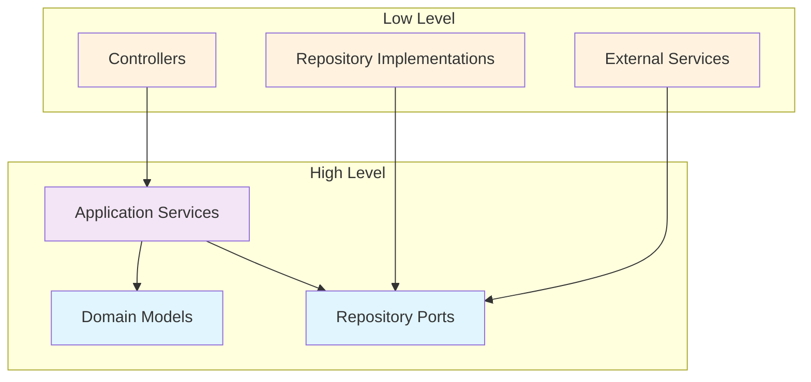
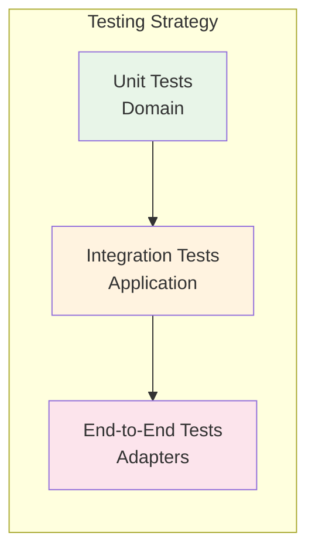

# 🏗️ Arquitectura Hexagonal (Ports & Adapters)

## 📋 Descripción General

Este proyecto implementa la **Arquitectura Hexagonal** (también conocida como Ports & Adapters) en ambos microservicios. Esta arquitectura promueve la separación de responsabilidades, la independencia de frameworks y la testabilidad del código.

## 🎯 Principios de la Arquitectura Hexagonal

### Objetivos Principales
- **Independencia de Frameworks**: El dominio no depende de tecnologías externas
- **Testabilidad**: Fácil testing de cada capa de forma aislada
- **Flexibilidad**: Cambio de tecnologías sin afectar la lógica de negocio
- **Separación de Responsabilidades**: Cada capa tiene una responsabilidad específica

## 🏛️ Estructura de Capas

### Diagrama de Arquitectura Hexagonal



## 📁 Estructura de Directorios

### Product Service
```
product-service/src/main/java/dev/scastillo/product/
├── adapter/                    # 🎯 Adapters (Outer Layer)
│   └── web/                   # Web Adapters
│       ├── controller/        # REST Controllers
│       ├── dto/              # Data Transfer Objects
│       └── mapper/           # Object Mappers
├── application/               # 🎯 Application (Inner Layer)
│   └── service/              # Application Services
├── domain/                   # 🎯 Domain (Core)
│   ├── model/                # Domain Entities
│   ├── repository/           # Repository Ports (Interfaces)
│   └── service/              # Domain Services
├── infraestructure/          # 🎯 Infrastructure Adapters
│   └── repository/           # Repository Implementations
├── config/                   # Configuration
└── shared/                   # Shared Components
```

### Inventory Service
```
inventory-service/src/main/java/dev/scastillo/inventory/
├── adapter/                   # 🎯 Adapters (Outer Layer)
│   └── web/                  # Web Adapters
│       ├── controller/       # REST Controllers
│       ├── dto/             # Data Transfer Objects
│       └── mapper/          # Object Mappers
├── application/              # 🎯 Application (Inner Layer)
│   └── service/             # Application Services
├── domain/                  # 🎯 Domain (Core)
│   ├── model/               # Domain Entities
│   ├── repository/          # Repository Ports (Interfaces)
│   └── service/             # Domain Services
├── infraestructure/         # 🎯 Infrastructure Adapters
│   ├── repository/          # Repository Implementations
│   └── rest/               # External Service Clients
├── config/                  # Configuration
└── shared/                  # Shared Components
```

## 🔄 Flujo de Datos

### Diagrama de Flujo



## 🎯 Capas y Responsabilidades

### 1. 🏛️ Domain Layer (Core)
**Responsabilidad**: Lógica de negocio pura, sin dependencias externas

#### Componentes:
- **Domain Models**: Entidades del negocio
- **Repository Ports**: Interfaces para acceso a datos
- **Domain Services**: Lógica de negocio compleja

#### Ejemplo:
```java
// Domain Model
@Entity
public class Product {
    private Integer id;
    private String name;
    private BigDecimal price;
    // Lógica de negocio pura
}

// Repository Port
public interface ProductRepository {
    Product save(Product product);
    Optional<Product> findById(Integer id);
}
```

### 2. 🎯 Application Layer (Inner)
**Responsabilidad**: Orquestación de casos de uso

#### Componentes:
- **Application Services**: Implementación de casos de uso
- **Use Cases**: Lógica de aplicación

#### Ejemplo:
```java
@Service
public class ProductServiceImpl implements ProductService {
    private final ProductRepository productRepository;
    
    public ProductResponse createProduct(CreateProductRequest request) {
        // Orquestación del caso de uso
        Product product = new Product(request.getName(), request.getPrice());
        Product savedProduct = productRepository.save(product);
        return ProductMapper.toResponse(savedProduct);
    }
}
```

### 3. 🎯 Adapter Layer (Outer)
**Responsabilidad**: Adaptación a tecnologías externas

#### Componentes:
- **Controllers**: Adaptadores HTTP
- **DTOs**: Objetos de transferencia de datos
- **Mappers**: Conversión entre capas

#### Ejemplo:
```java
@RestController
public class ProductController {
    private final ProductService productService;
    
    @PostMapping("/products")
    public ResponseEntity<ProductResponseDto> createProduct(@RequestBody ProductCreateRequestDto request) {
        ProductResponse response = productService.createProduct(request);
        return ResponseEntity.ok(ProductMapper.toDto(response));
    }
}
```

### 4. 🎯 Infrastructure Layer (Outer)
**Responsabilidad**: Implementación de puertos

#### Componentes:
- **Repository Implementations**: Implementación de repositorios
- **External Service Clients**: Clientes de servicios externos

#### Ejemplo:
```java
@Repository
public class JpaProductRepository implements ProductRepository {
    private final SpringDataProductRepository repository;
    
    @Override
    public Product save(Product product) {
        ProductEntity entity = ProductMapper.toEntity(product);
        ProductEntity savedEntity = repository.save(entity);
        return ProductMapper.toDomain(savedEntity);
    }
}
```

## 🔄 Inversión de Dependencias

### Diagrama de Dependencias



## ✅ Ventajas de la Arquitectura Hexagonal

### 1. 🧪 Testabilidad
- **Testing Aislado**: Cada capa se puede testear independientemente
- **Mocks Fáciles**: Interfaces permiten mocking simple
- **Testing de Dominio**: Lógica de negocio sin dependencias

### 2. 🔄 Flexibilidad
- **Cambio de Frameworks**: Sin afectar lógica de negocio
- **Cambio de Base de Datos**: Implementación de repositorios
- **Cambio de APIs**: Nuevos adaptadores sin tocar core

### 3. 🏗️ Mantenibilidad
- **Separación Clara**: Responsabilidades bien definidas
- **Código Limpio**: Principios SOLID aplicados
- **Escalabilidad**: Fácil agregar nuevas funcionalidades

### 4. 🎯 Independencia
- **Framework Agnostic**: Dominio no depende de Spring
- **Technology Agnostic**: Fácil cambio de tecnologías
- **Business Focus**: Enfoque en lógica de negocio

## 🔧 Implementación en el Proyecto

### Product Service
```java
// Domain Layer
public class Product { /* Domain Model */ }
public interface ProductRepository { /* Port */ }

// Application Layer
public class ProductServiceImpl implements ProductService { /* Use Case */ }

// Adapter Layer
public class ProductController { /* HTTP Adapter */ }

// Infrastructure Layer
public class JpaProductRepository implements ProductRepository { /* Implementation */ }
```

### Inventory Service
```java
// Domain Layer
public class ProductStock { /* Domain Model */ }
public interface ProductStockRepository { /* Port */ }

// Application Layer
public class ProductStockServiceImpl implements ProductStockService { /* Use Case */ }

// Adapter Layer
public class InventoryController { /* HTTP Adapter */ }

// Infrastructure Layer
public class JpaProductStockRepository implements ProductStockRepository { /* Implementation */ }
```

## 🧪 Testing Strategy

### Testing por Capas



### Ejemplo de Testing
```java
// Domain Testing
@Test
void shouldCalculateTotalPrice() {
    Product product = new Product("Laptop", BigDecimal.valueOf(1000));
    assertEquals(BigDecimal.valueOf(1000), product.getPrice());
}

// Application Testing
@Test
void shouldCreateProduct() {
    ProductService service = new ProductServiceImpl(mockRepository);
    ProductResponse response = service.createProduct(request);
    assertNotNull(response);
}

// Adapter Testing
@Test
void shouldReturnProductWhenValidRequest() {
    mockMvc.perform(post("/api/v1/products")
        .contentType(MediaType.APPLICATION_JSON)
        .content(jsonRequest))
        .andExpect(status().isOk());
}
```

## 🚀 Beneficios en Microservicios

### 1. **Independencia de Servicios**
- Cada microservicio tiene su propio dominio
- Interfaces bien definidas entre servicios
- Fácil evolución independiente

### 2. **Escalabilidad**
- Capas se pueden escalar independientemente
- Fácil agregar nuevos adaptadores
- Testing de integración simplificado

### 3. **Mantenimiento**
- Cambios localizados por capas
- Fácil debugging y troubleshooting
- Código más legible y organizado

## 📊 Métricas de Calidad

### Cobertura por Capas
- **Domain Layer**: > 90%
- **Application Layer**: > 85%
- **Adapter Layer**: > 80%
- **Infrastructure Layer**: > 75%

### Principios Aplicados
- ✅ **Single Responsibility Principle**
- ✅ **Open/Closed Principle**
- ✅ **Dependency Inversion Principle**
- ✅ **Interface Segregation Principle**

## 🎯 Conclusiones

La arquitectura hexagonal implementada en este proyecto proporciona:

1. **Flexibilidad**: Fácil cambio de tecnologías
2. **Testabilidad**: Testing aislado por capas
3. **Mantenibilidad**: Código organizado y limpio
4. **Escalabilidad**: Fácil agregar nuevas funcionalidades
5. **Independencia**: Dominio libre de frameworks

Esta arquitectura es especialmente beneficiosa en microservicios, donde cada servicio puede evolucionar independientemente manteniendo la coherencia del sistema. 