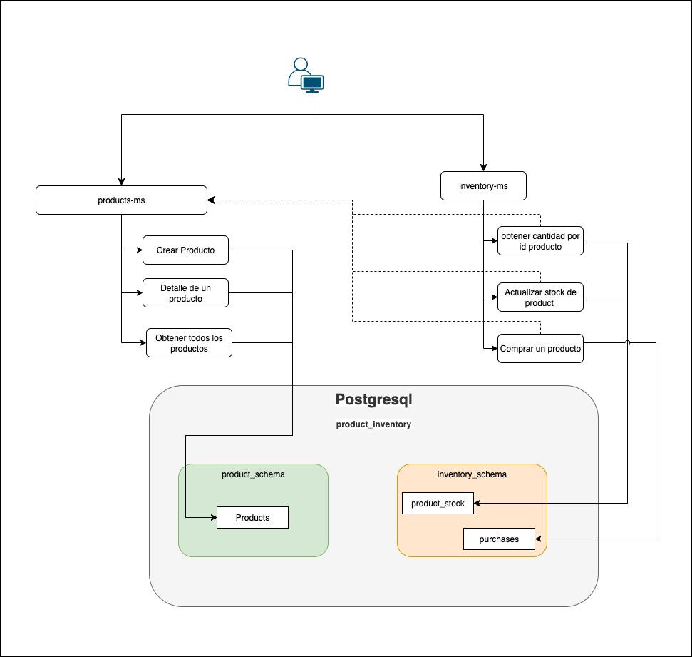
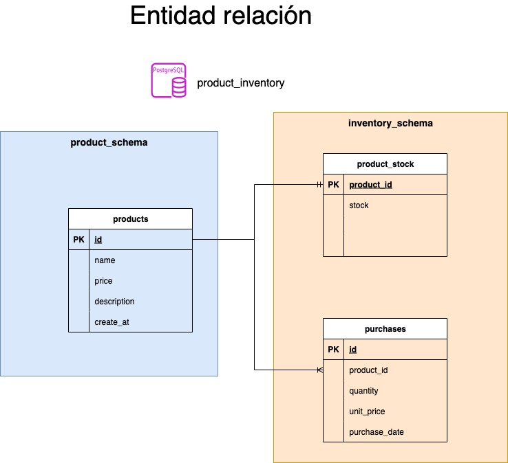

# Product Inventory Microservices

## 📋 Descripción

Este proyecto implementa una arquitectura de microservicios desarrollada en **Java 21** y **Spring Boot 3.5.4** para la gestión de productos e inventario. El sistema está compuesto por dos microservicios independientes que trabajan en conjunto para proporcionar una solución completa de gestión de productos.

## 🏗️ Arquitectura

### Microservicios

1. **Product Service** (`product-service`)
   - **Puerto**: 8080
   - **Responsabilidad**: Gestión de productos (CRUD)
   - **Base de datos**: PostgreSQL (schema: `product_schema`)

2. **Inventory Service** (`inventory-service`)
   - **Puerto**: 8081
   - **Responsabilidad**: Gestión de inventario y compras
   - **Base de datos**: PostgreSQL (schema: `inventory_schema`)
   - **Comunicación**: Se comunica con Product Service para obtener información de productos

### Diagrama de Arquitectura



## 🗄️ Diseño Entidad-Relación

### Diagrama Entidad-Relación



## 🚀 Tecnologías Utilizadas

- **Java**: 21
- **Spring Boot**: 3.5.4
- **Spring Data JPA**: Para persistencia de datos
- **PostgreSQL**: Base de datos principal
- **H2**: Base de datos para pruebas
- **MapStruct**: Para mapeo de objetos
- **Lombok**: Para reducir código boilerplate
- **Spring Security**: Para autenticación por API Key
- **Spring Actuator**: Para monitoreo

## 📦 Estructura del Proyecto

```
product-inventory-microservices/
├── product-service/          # Microservicio de productos
│   ├── src/main/java/dev/scastillo/product/
│   │   ├── adapter/web/     # Controladores y DTOs
│   │   ├── application/     # Lógica de aplicación
│   │   ├── domain/          # Modelos de dominio
│   │   └── infraestructure/ # Repositorios
│   └── src/main/resources/
│       └── application.yml
├── inventory-service/        # Microservicio de inventario
│   ├── src/main/java/dev/scastillo/inventory/
│   │   ├── adapter/web/     # Controladores y DTOs
│   │   ├── application/     # Lógica de aplicación
│   │   ├── domain/          # Modelos de dominio
│   │   └── infraestructure/ # Repositorios y clientes REST
│   └── src/main/resources/
│       └── application.yml
└── documentation/           # Documentación adicional
```

## 🗄️ Base de Datos

### Configuración PostgreSQL

El proyecto incluye un Docker Compose con PostgreSQL 17 configurado automáticamente:

```bash
# Variables de entorno de la base de datos
DB_HOST=localhost
DB_NAME=product_inventory
DB_PASSWORD=DevSecurePass2024!
DB_PORT=5432
DB_USER=dev_user
```

### Levantar Base de Datos

```bash
# Navegar al directorio de Docker
cd resources/docker

# Levantar PostgreSQL
docker-compose up -d

# Verificar que esté corriendo
docker-compose ps
```

### Esquemas Automáticos

Al levantar la base de datos, se crean automáticamente los siguientes esquemas:
- `product_schema` - Para el microservicio de productos
- `inventory_schema` - Para el microservicio de inventario

### Conectar desde Aplicaciones Locales

Para conectar tus aplicaciones locales a la base de datos, puedes configurar las siguientes variables de entorno:

```bash
# Variables de entorno para conectar a la base de datos
export DB_HOST=localhost
export DB_NAME=product_inventory
export DB_PASSWORD=DevSecurePass2024!
export DB_PORT=5432
export DB_USER=dev_user
export API_KEY=b0cd16a8-0b85-43da-9407-04731b5e4086
```

Los microservicios ya están configurados para usar estas variables de entorno en sus archivos `application.yml`:

```yaml
# Product Service - application.yml
spring:
  datasource:
    url: jdbc:postgresql://${DB_HOST}:${DB_PORT}/${DB_NAME}?options=-c%20timezone=America/Bogota
    username: ${DB_USER}
    password: ${DB_PASSWORD}
    driver-class-name: org.postgresql.Driver
  jpa:
    properties:
      hibernate:
        default_schema: product_schema

# Inventory Service - application.yml
spring:
  datasource:
    url: jdbc:postgresql://${DB_HOST}:${DB_PORT}/${DB_NAME}?options=-c%20timezone=America/Bogota
    username: ${DB_USER}
    password: ${DB_PASSWORD}
    driver-class-name: org.postgresql.Driver
  jpa:
    properties:
      hibernate:
        default_schema: inventory_schema
```

**Nota**: Los archivos `application.yml` ya están configurados para usar variables de entorno, por lo que solo necesitas exportar las variables antes de ejecutar los servicios.

## 🛠️ Instalación y Ejecución

### Prerrequisitos

- Java 21
- Maven 3.6+
- PostgreSQL 12+
- Docker (opcional)

### Pasos de Instalación

1. **Clonar el repositorio**
   ```bash
   git clone <repository-url>
   cd product-inventory-microservices
   ```

2. **Levantar Base de Datos**
   ```bash
   cd resources/docker
   docker-compose up -d
   ```

3. **Configurar variables de entorno**
   ```bash
   export DB_HOST=localhost
   export DB_PORT=5432
   export DB_NAME=product_inventory
   export DB_USER=dev_user
   export DB_PASSWORD=DevSecurePass2024!
   export API_KEY=b0cd16a8-0b85-43da-9407-04731b5e4086
   ```

4. **Ejecutar Product Service**
   ```bash
   cd product-service
   mvn spring-boot:run
   ```

5. **Ejecutar Inventory Service**
   ```bash
   cd inventory-service
   mvn spring-boot:run
   ```

### Ejecución con Docker

```bash
# Construir imágenes
docker build -t product-service ./product-service
docker build -t inventory-service ./inventory-service

# Ejecutar contenedores
docker run -p 8080:8080 product-service
docker run -p 8081:8081 inventory-service
```

## 📚 API Endpoints

### Product Service (Puerto 8080)

#### Productos
- `GET /api/v1/products` - Obtener todos los productos
- `GET /api/v1/products/{id}` - Obtener producto por ID
- `POST /api/v1/products` - Crear nuevo producto
- `PUT /api/v1/products/{id}` - Actualizar producto
- `DELETE /api/v1/products/{id}` - Eliminar producto

### Inventory Service (Puerto 8081)

#### Inventario
- `GET /api/v1/inventory` - Obtener inventario de todos los productos
- `GET /api/v1/inventory/{productId}` - Obtener stock de un producto
- `PUT /api/v1/inventory/{productId}/stock` - Actualizar stock de un producto

#### Compras
- `GET /api/v1/purchases` - Obtener todas las compras
- `GET /api/v1/purchases/{id}` - Obtener compra por ID
- `POST /api/v1/purchases` - Crear nueva compra

## 📁 Colección de Postman

Para facilitar las pruebas de la API, se incluyen las colecciones de Postman con todos los endpoints configurados.

### Descargar Colecciones

📥 [Descargar Colección de Postman](./resources/postman/product-inventory-microservices.postman_collection.json)

📥 [Descargar Variables de Entorno](./resources/postman/product-inventory-microservices.postman_environment.json)

### Importar Colecciones

1. Descargar ambas colecciones desde los enlaces anteriores
2. Importar la colección en Postman
3. Importar las variables de entorno en Postman
4. Las variables ya están configuradas:
   - `host-product-service`: `localhost:8080`
   - `host-inventory-service`: `localhost:8081`
   - `api-key`: `b0cd16a8-0b85-43da-9407-04731b5e4086`
   - `productId`: Se configura automáticamente

### Variables de Entorno Configuradas

```json
{
  "host-product-service": "localhost:8080",
  "host-inventory-service": "localhost:8081",
  "api-key": "b0cd16a8-0b85-43da-9407-04731b5e4086",
  "productId": ""
}
```

## 🧪 Testing

### Ejecutar Tests

```bash
# Product Service
cd product-service
mvn test

# Inventory Service
cd inventory-service
mvn test
```

### Cobertura de Tests

- **Unit Tests**: Pruebas unitarias para servicios y controladores
- **Integration Tests**: Pruebas de integración para endpoints
- **Repository Tests**: Pruebas para repositorios JPA

## 📊 Monitoreo

### Health Checks

- Product Service: `http://localhost:8080/actuator/health`
- Inventory Service: `http://localhost:8081/actuator/health`


## 🔒 Seguridad

El sistema implementa autenticación basada en API Key:

- **Header requerido**: `X-API-Key`
- **Valor**: Configurado en la variable de entorno `API_KEY`

### Ejemplo de uso

```bash
curl -H "X-API-Key: b0cd16a8-0b85-43da-9407-04731b5e4086" \
     -H "Content-Type: application/json" \
     http://localhost:8080/api/v1/products
```

